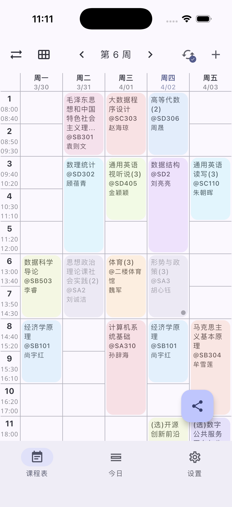
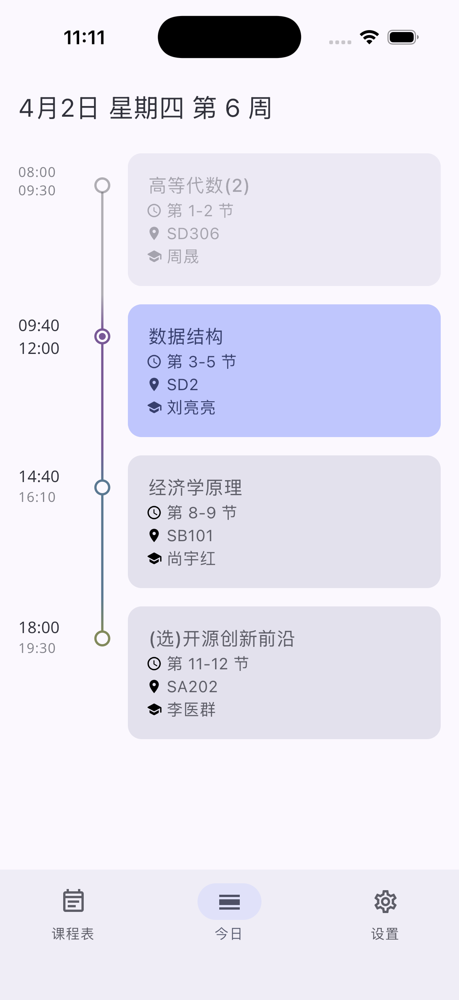
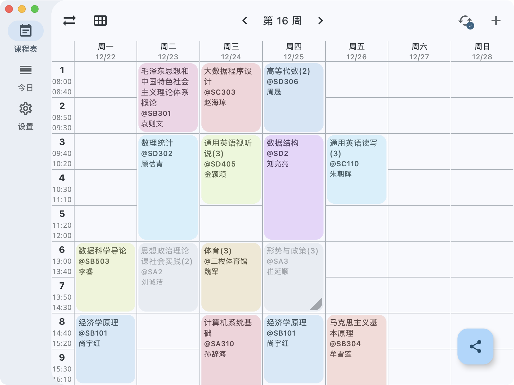
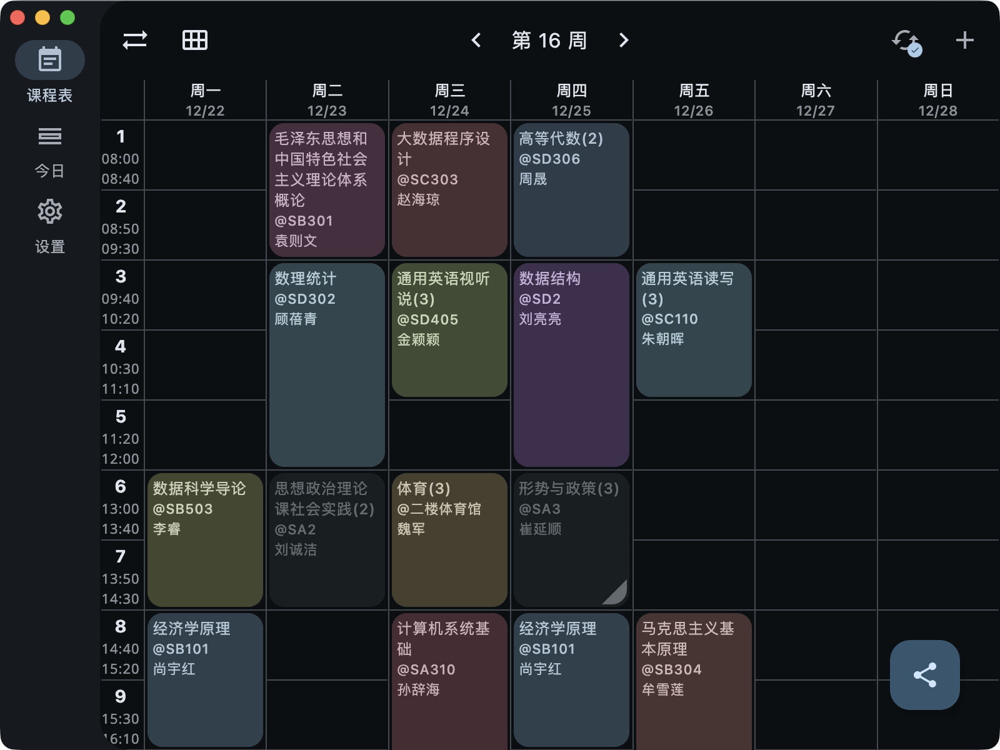

# TimeFlow

TimeFlow 是一款使用 [Compose Multiplatform](https://github.com/JetBrains/compose-multiplatform)
构建的、使用 [Material Design 3 Expressive](https://m3.material.io) 设计风格的课程表应用，旨在提供简洁、美观、现代的用户体验。

[](https://github.com/Lyxot/TimeFlow)
[](https://github.com/Lyxot/TimeFlow/issues)

[](https://github.com/sponsors/Lyxot)

## ✨ 功能特性

- **跨平台支持**: 一份代码库，可在 Android, iOS, 和 桌面端 (Windows, macOS, Linux) 运行。
- **课程表管理**: 轻松创建、编辑和管理您的课程表和课程。
- **高度可定制**:
    - 支持 Material Design 3 动态取色。
    - 可自定义主题颜色。
    - 浅色与深色模式切换。
- **富有表现力的设计**: 基于 Material Design 3 Expressive 设计风格，提供流畅的动画和现代的视觉体验。

| 课程表 | 今日 |
| --- | --- |
|  |  |

| 深色模式 | 浅色模式 |
| --- | --- |
|  |  |

## 🚀 如何构建

在开始之前，请确保您已经安装了：

- JDK 17 或更高版本
- Android SDK (并将路径配置在项目的 `local.properties` 文件中)
- （可选）[KDoctor](https://github.com/Kotlin/kdoctor) 来检查您的开发环境

**构建 Android 应用 (APK):**

```bash
./gradlew :composeApp:assembleDebug
```

生成的 APK 文件位于 `composeApp/build/outputs/apk/debug/composeApp-debug.apk`。

**运行桌面端应用:**

```bash
./gradlew :composeApp:run
```

**运行测试:**

```bash
./gradlew jvmTest
```

## License
See [LICENSE](./LICENSE) for more information
