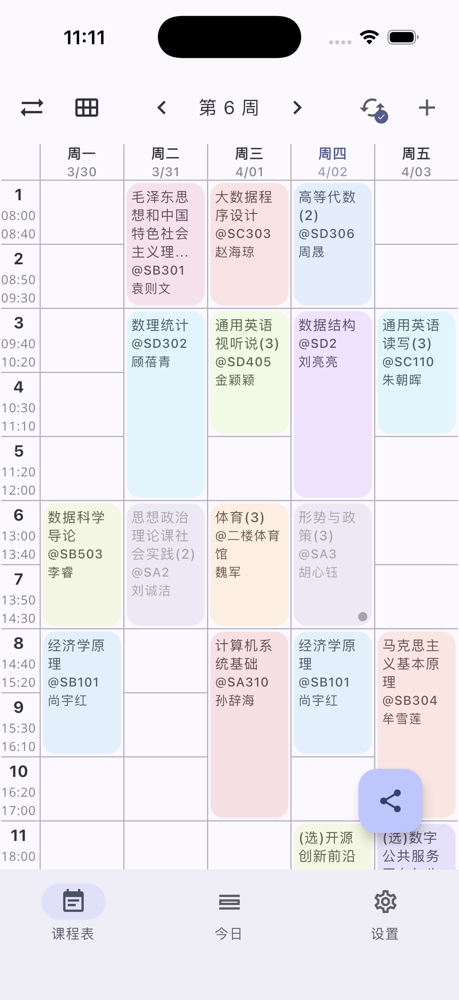
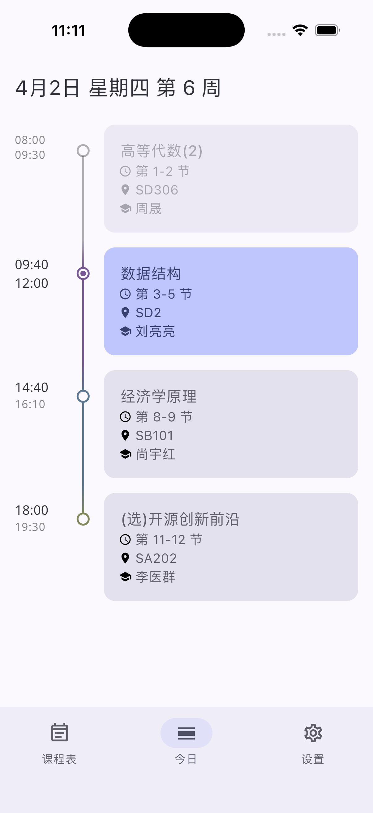
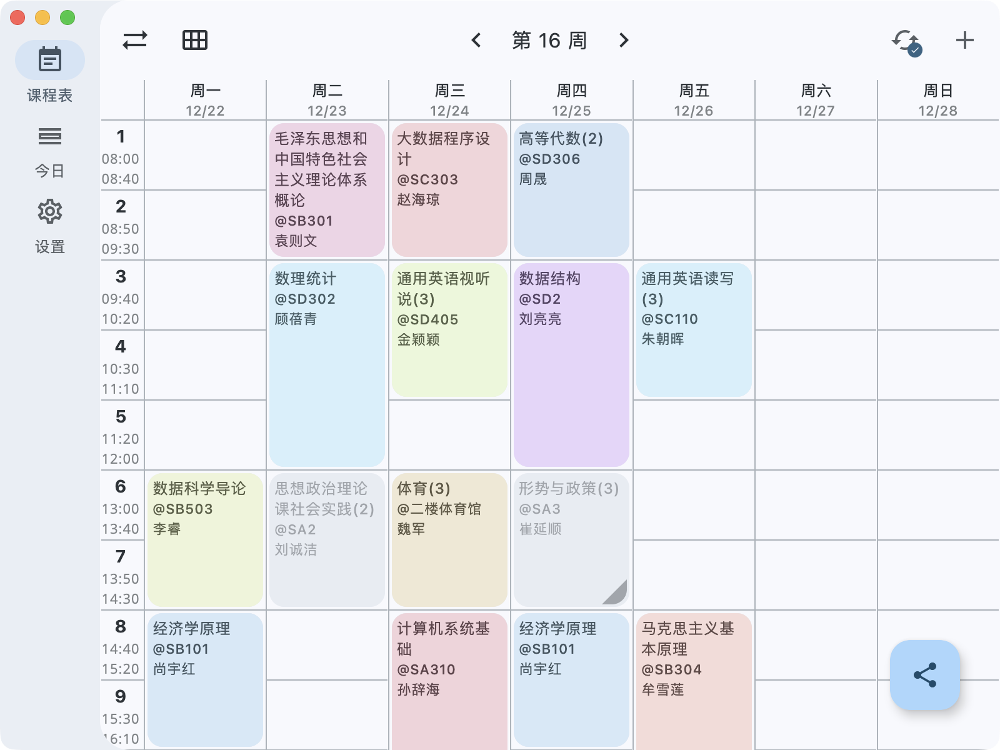
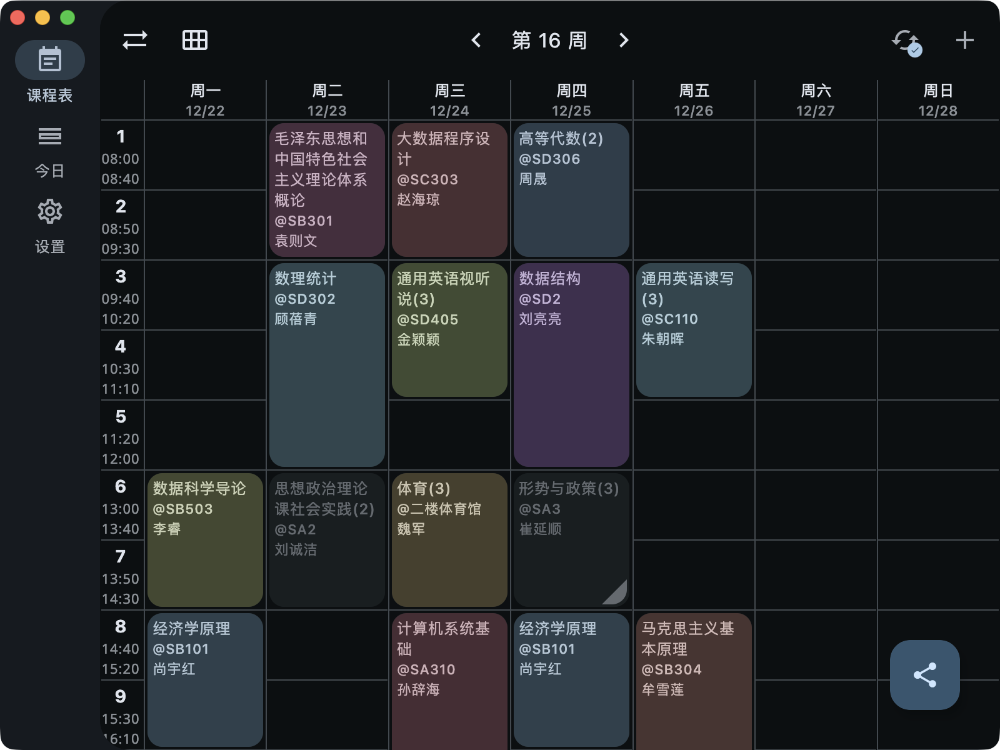

# TimeFlow

TimeFlow 是一款使用 [Compose Multiplatform](https://github.com/JetBrains/compose-multiplatform)
构建的、使用 [Material Design 3 Expressive](https://m3.material.io) 设计风格的课程表应用，旨在提供简洁、美观、现代的用户体验。

[](https://github.com/Lyxot/TimeFlow)
[](https://github.com/Lyxot/TimeFlow/issues)

[](https://github.com/sponsors/Lyxot)

## ✨ 功能特性

- **跨平台支持**: 一份代码库，可在 Android, iOS, 和 桌面端 (Windows, macOS, Linux) 运行。
- **课程表管理**: 轻松创建、编辑和管理您的课程表和课程。
- **高度可定制**:
    - 支持 Material Design 3 动态取色。
    - 可自定义主题颜色。
    - 浅色与深色模式切换。
- **富有表现力的设计**: 基于 Material Design 3 Expressive 设计风格，提供流畅的动画和现代的视觉体验。
- **云同步**: 支持通过 API 服务端提供云同步功能。
- **分享**: 
    - 支持将课程表导出为文件/图片。
    - 支持从文件/图片导入课程表。
    - 支持使用 AI 从普通图片中提取课程表信息。

| 课程表 | 今日 |
| --- | --- |
|  |  |

| 浅色模式 | 深色模式 |
| --- | --- |
|  |  |

## 🔧 后端部署

TimeFlow 支持通过 API 服务端提供云同步功能，并支持通过 Docker 私有化部署。

有关后端部署和 API 文档，请参考 [Server README](./api/README.md) 和 [API README](./api/models/README.md)。

## 🚀 如何构建

在开始之前，请确保您已经安装了：

- JDK 17 或更高版本
- Android SDK (并将路径配置在项目的 `local.properties` 文件中)
- （可选）[KDoctor](https://github.com/Kotlin/kdoctor) 来检查您的开发环境

构建任务统一使用 `build{Target}{BuildType}{Format}` 命名格式，例如 `buildAndroidReleaseApk`、`buildLinuxDebugAppImage`。

**构建 Android 应用:**

```bash
./gradlew buildAndroidReleaseApk
```

**构建 iOS 应用:**

```bash
./gradlew buildIosReleaseIpa
```

**构建桌面端应用:**

```bash
# macOS
./gradlew buildMacosReleaseDmg

# Linux
./gradlew buildLinuxReleaseAppImage
./gradlew buildLinuxReleaseDeb
./gradlew buildLinuxReleaseRpm

# Windows
./gradlew buildWindowsReleaseMsi
./gradlew buildWindowsReleaseExe
./gradlew buildWindowsReleasePortable
```

> **注意**: 桌面端构建任务只能在对应的操作系统上运行，且不支持跨架构构建。例如，`buildMacOSReleaseDmg` 只能在 macOS 上运行。

**构建 Web 应用:**

```bash
./gradlew buildJsReleaseZip
./gradlew buildWasmJsReleaseZip
```

生成的构建产物位于 `builder/build/artifacts` 目录下。

**运行测试:**

```bash
./gradlew :app:shared:jvmTest
```

## License
See [LICENSE](./LICENSE) for more information
